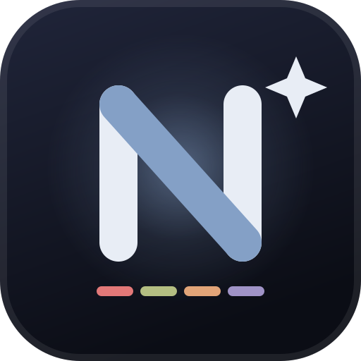

# NovaTerm



A desktop terminal built with **Tauri 2, Rust, React, and xterm.js**. Run native
shells, organize tabs and split panes, customize colors and fonts, manage SSH
profiles, and extend the application with plugins.

Windows is covered by native CI. Linux and macOS support is being validated;
cross-platform installers are not yet published. Windows installers are prepared
through the [release workflow](docs/RELEASING.md). The plugin SDK is
[available on npm](https://www.npmjs.com/package/@diegolopez02081/novaterm-plugin-sdk).

## Features

- Native PTYs for PowerShell, CMD, Git Bash, WSL, and SSH profiles.
- Persistent tab/pane sessions when switching layouts and tabs.
- Command palette, terminal search, configurable colors, and GPU rendering.
- Bundled Nova Mono and Nerd Font symbols, with installed system-font choices.
- Hot-reloaded TOML configuration that preserves the last valid settings on errors.
- Declarative widget/profile plugins and permission-controlled JavaScript panels.
- Raw byte IPC, bounded output queues, parser acknowledgements, and serialized input.

## Keyboard shortcuts

| Shortcut | Action |
| --- | --- |
| `Ctrl+C` / `Ctrl+V` | Copy selection / paste |
| `Ctrl+Shift+C` / `Ctrl+Shift+V` | Copy / paste |
| `Ctrl+Insert` / `Shift+Insert` | Copy / paste |
| `Ctrl+Shift+P` | Command palette |
| `Ctrl+Shift+F` | Search terminal output |
| `Ctrl+Shift+M` | Plugin catalog |
| `Ctrl+,` | Settings |
| `Ctrl+Shift+T` | New tab |
| `Ctrl+Shift+W` | Close tab |
| `Ctrl+Tab` / `Ctrl+Shift+Tab` | Next / previous tab |
| `Ctrl+Alt+1` through `9` | Select a tab |
| `Ctrl+Shift+D` | Split right |
| `Ctrl+Shift+E` | Split down |
| `Ctrl+Shift+X` | Close pane |
| `Ctrl+Shift+Left` / `Right` | Previous / next pane |
| `Ctrl++` / `Ctrl+-` / `Ctrl+0` | Increase / decrease / reset font size |
| `Ctrl+mouse wheel` | Adjust font size |
| `F11` | Fullscreen |

Double-click a tab to rename it, middle-click to close it, and right-click a
terminal for its context menu. `Ctrl+C` copies only when text is selected;
otherwise it remains the process interrupt. Pasting respects bracketed paste
when the running program enables it.

## Configuration

Open settings with `Ctrl+,`. Configuration is stored at:

- Windows: `%APPDATA%\novaterm\config.toml`
- Linux/macOS: `~/.novaterm/config.toml`

The file is reloaded on changes. Invalid TOML keeps the previous configuration
and displays an error. `ui.welcome = false` disables the welcome output.
`terminal.gpu = false` selects the DOM renderer. `window.opacity` changes the
background opacity without making the text transparent; Windows blur can be
toggled from settings.

### Shell profiles

Settings can add custom profiles and rediscover installed shells. A profile has
a name, executable, individual arguments, optional starting directory, and icon.
Enter one argument per line; paths containing spaces remain a single argument.
Custom profiles take precedence over detected profiles with the same ID.

### SSH connections

Connections are stored in `~/.novaterm/ssh.toml` and appear as tab profiles.
The following legacy keys remain supported:

```toml
[[conexiones]]
id = "production"
nombre = "Production"
host = "192.168.1.50"
usuario = "deploy"
puerto = 22
identidad = "C:\\Users\\you\\.ssh\\id_ed25519"
```

Passwords are not saved. Use an SSH key, or enter a password directly into the
SSH process when prompted.

## Fonts and rendering

Nova Mono is a custom [Iosevka](https://github.com/be5invis/Iosevka) build with a
dotted zero and programming ligatures. Nerd Font symbols are appended as a
fallback regardless of the selected font. Bundled font licenses are retained
under `src/assets/fonts/`.

The terminal supports ANSI colors, the 256-color palette, true color, bold,
italic, underline, inverse video, and Nerd Font prompts. WebGL renders the
focused pane; the DOM renderer is the fallback when GPU rendering is disabled
or unavailable.

## Plugins

Each plugin lives in a directory under `~/.novaterm/plugins/` with `plugin.toml`.
Declarative plugins contribute status widgets and shell profiles. For example:

```toml
id = "git-status"
name = "Git branch"
version = "0.1.0"
description = "Show the active repository branch."

[[widgets]]
id = "branch"
command = "git"
args = ["branch", "--show-current"]
interval_ms = 10000
prefix = "git: "
use_cwd = true
```

Legacy `intervalo_ms`, `prefijo`, and `usar_cwd` keys are also accepted.
Directory-aware widgets depend on the shell reporting its CWD via OSC 7.
Widget commands run with separate executable/argument values; a plugin can
explicitly invoke a shell, so review commands before installing a local plugin.

JavaScript plugins declare an `entry`, commands, and permissions. They run in
sandboxed iframes with a broker for `terminal.read`, `terminal.write`,
`ui.panel`, `llm.complete`, and `commands`. Installing a plugin does not grant
its requested permissions. API keys remain in the native credential store.
Manage installed plugin permissions and provider credentials in **Settings →
Plugins & AI**. Open installed panels from **Plugins → Installed → Open panel**
or the command palette. The library works with local plugins even when the
registry is unavailable. Start with the [seven starter plugins](examples/plugins/README.md) and
[authoring guide](docs/PLUGIN-AUTHORING.md). The typed SDK lives in
[`packages/plugin-sdk`](packages/plugin-sdk) and can be installed with
`npm install @diegolopez02081/novaterm-plugin-sdk`.

The marketplace currently defaults to a **self-hosted local registry** at
`http://127.0.0.1:8787`. Archive hashes and publisher signatures are checked
before installation. A public catalog has not been deployed.

## Resource use and stability

History scrolling uses a short 120 ms transition by default. Adjust **Smooth
history scrolling** in **Settings → Terminal** (0 disables it; maximum 250 ms),
or set `smooth_scroll_ms` in `[terminal]` in your config. The **Animations**
switch controls UI transitions and history motion. System reduced-motion
preferences take priority. Inactive panes and hidden windows scroll instantly.
This affects visual scrolling; PTY output continues to be parsed without an
animation delay. Cursor trails are not implemented.

Output is batched into packets of at most 64 KiB. A per-session credit window
limits unparsed IPC bytes to 256 KiB, alongside a bounded native reader queue.
Input is serialized and bounded; resizes are coalesced. Closing a session
cancels pending transport work, and a blocked writer does not lock other sessions.

Plugin widgets wait for completion before scheduling another run, with two
concurrent commands, five-second deadlines, limited captured output, and retry
backoff. Background windows pause status/widget polling. Windows WebView2 memory
controls and delayed WebGL disposal are also present.

See [PTY transport details](docs/PTY-FLOW-CONTROL.md) and the
[Windows resource benchmark guide](docs/RESOURCE-BENCHMARK.md). Runtime CPU/RAM
savings require a controlled before/after measurement; build size and passing
tests are not memory benchmarks.

## Development

Install Node.js 24 and a current stable Rust toolchain, plus the
[Tauri prerequisites](https://v2.tauri.app/start/prerequisites/) for your OS.

```sh
npm ci
npm run tauri dev
```

Checks:

```sh
npm run lint -- --deny-warnings
npm test
npm run build
cargo test --manifest-path src-tauri/Cargo.toml --lib --locked
```

Create a native build with `npm run tauri build`, or compile a debug executable
with embedded assets using `npm run tauri -- build --debug --no-bundle`.
Build outputs are under `src-tauri/target/`.

Native PTY tests start real shells and Node processes. The registry installation
integration test requires the local registry and is ignored in the default suite.
One additional ignored entry is a subprocess fixture used by widget limit tests.

See [CONTRIBUTING.md](CONTRIBUTING.md) for changes and validation expectations.
See [RELEASING.md](docs/RELEASING.md) for draft Windows releases and SDK package publication.

## License

NovaTerm and the plugin SDK are licensed under [MIT](LICENSE). Bundled fonts
retain their separate notices in `src/assets/fonts/`.
